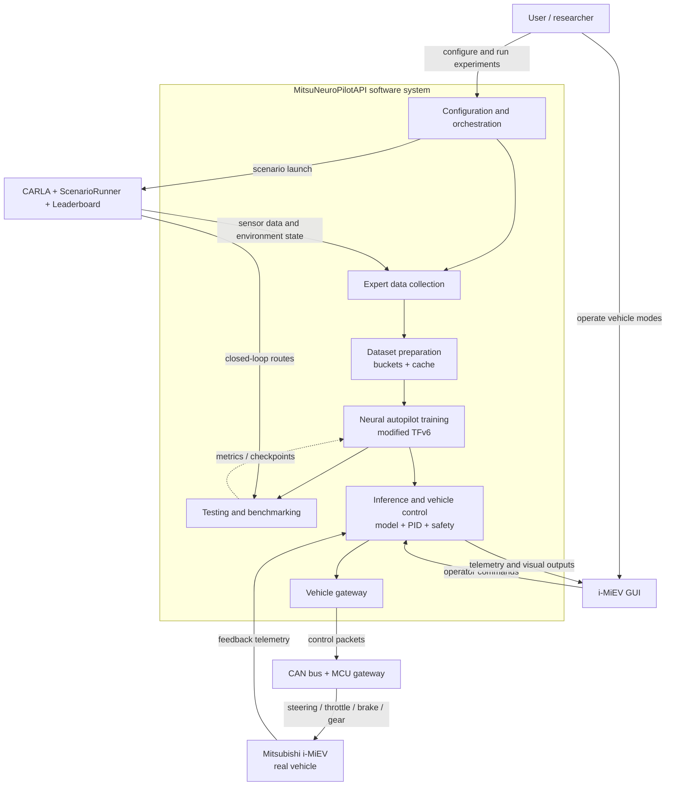

# MitsuNeuroPilotAPI

MitsuNeuroPilotAPI is a full-stack neural autopilot project for autonomous driving research and deployment on a Mitsubishi i-MiEV electric vehicle.

## What This Project Includes

- CARLA simulation environment support for data collection, training, closed-loop evaluation, and visual debugging.
- Custom route and scenario tooling for different road situations, weather, time of day, traffic interactions, and failure cases.
- An improved script-based expert driver with a camera-limited observation setup that is closer to a real vehicle camera rig and therefore reduces learner-expert asymmetry.
- A modified TransFuser V6-style neural autopilot with transformer feature fusion, geometry-aware BEV projection, detection, segmentation, waypoint prediction, target-speed prediction, and PID control.
- Dual-front-camera model support using a wide 2.8 mm / 90 degree camera and a narrow 6 mm / 50 degree camera with overlapping fields of view for stereo-like depth cues.
- Dataset bucket/cache tooling, image augmentation, and two-stage training for scalable pre-training and post-training.
- Bench2Drive, Longest6, Town13, CARLA Leaderboard, ScenarioRunner, and NAVSIM-related tooling.
- An operator GUI for CARLA demos, mock vehicle testing, serial loopback testing, telemetry, manual takeover, and real i-MiEV integration.
- A GUI navigation panel for A-to-B missions, route validation, waypoint tracking, road-routing, route preview, and PID fallback when neural predictions are unavailable.
- Map and mission configuration support for real/mock operation, including route metadata, current-pose configuration, map settings, and reusable mission files.
- Vehicle telemetry dashboards for speed, steering angle, throttle, brake, gear, pose state, route progress, neural-agent status, BEV detection, and BEV segmentation outputs.
- Bench and hardware-readiness tooling for dry-run operation, preflight checks, MCU telemetry mapping, serial/CAN packet inspection, and staged transition from mock to telemetry-only to real actuation.
- A real-vehicle control layer with asynchronous GUI, hardware communication, neural-agent execution, safety checks, state machine transitions, command arbitration, MCU/CAN packet integration points, and preflight tooling.

## Project Motivation

Training a neural autopilot directly on a real car is expensive and dangerous. Simulation helps, but it creates three major problems:

- **Learner-expert asymmetry**: a simulator expert often uses privileged state that a real neural agent cannot observe.
- **Sim-to-real gap**: real cameras, latency, sensor noise, vehicle dynamics, and lighting differ from synthetic data.
- **Vision-only depth ambiguity**: pure monocular camera models are attractive for real deployment, but they often struggle with distance estimation, object motion, and braking decisions because depth is only inferred indirectly from a single image stream.

## Architecture Overview



## Model and Training Notes

The project extends a TransFuser V6-style architecture, but it changes the sensor layout, backbone choice, BEV projection, deployment graph, and real-vehicle interface. The model fuses visual embeddings, projects them into a bird's-eye-view representation, predicts auxiliary perception outputs, and plans motion through future waypoints and target speed.


### Main Differences from TFv6

- **Camera system**: TFv6 commonly uses a broader simulator sensor setup and baseline RGB configurations. This project uses two real-deployable front cameras: a 2.8 mm / 90 degree wide camera and a 6 mm / 50 degree narrow camera. The overlapping camera views provide stereo-like evidence for distance estimation, which is especially important because the target model does not rely on LiDAR.
- **Vision backbone**: the baseline ResNet-34 variant is replaced in the project design by ConvNeXt Nano to improve the speed/accuracy tradeoff for deployment.
- **Vision-only deployment target**: the project explicitly removes the dependence on LiDAR/radar in the real-vehicle path and compensates with dual-camera geometry and richer camera fusion.
- **BEV projection**: instead of relying only on learned layers, the BEV projection also uses camera placement and field-of-view information. This makes the model less tied to a single simulator sensor layout and closer to the physical camera rig.
- **Planner inputs**: BEV embeddings are fused with vehicle speed and navigation commands in the planner block. The planner predicts future waypoints and target speed, then PID controllers convert them into steering, throttle, and brake commands.
- **Deployment graph**: the architecture was rewritten and optimized into a more static inference graph for compilation and runtime stability.
- **Real control loop**: TFv6 mainly ends at CARLA/Leaderboard control. MitsuNeuroPilotAPI adds a GUI, state machine, command arbitration, MCU/CAN gateway, manual takeover, and safe disengagement behavior for a real vehicle.

### Training and Optimization

The training system uses bucket and cache storage for large CARLA datasets, image augmentations, and remote monitoring through Weights & Biases. Training is divided into two stages:

1. Encoder and BEV representation pre-training on detection and segmentation tasks.
2. Planner fine-tuning for route following, waypoint prediction, and target-speed prediction.

For deployment, the model path was optimized and converted toward a static graph. According to the project document, this reduced inference latency by about 5x and brought model inference time down to approximately `12 ms`. The asynchronous GUI/hardware/neural-agent loop reduced end-to-end control-loop delay to approximately `15 ms`.

Reported project results:

- waypoint displacement error: `0.13`;
- speed correlation: `0.95`;
- semantic mIoU: `0.70`;
- CenterNet mAP: `0.81`.

`Bench2Drive` closed-loop comparison at a 20 km/h speed cap:

| Model | Route completion | Rule compliance |
| --- | ---: | ---: |
| Baseline TransFuser | `79%` | `88%` |
| MitsuNeuroPilot modified TFv6 | `91%` | `82%` |

The modified model completed more route distance than the baseline. The lower rule-compliance score is attributed to the LiDAR-free setup, narrower total field of view, and smaller training dataset used in this project configuration.

The same deployment stack was tested on a real proving ground. The tests included straight-line autonomous motion, acceleration and speed holding, turning, pedestrian and vehicle interactions, traffic-light reaction, stop commands, and autonomous-mode disengagement. Future work includes additional fine-tuning on real data to reduce the sim-to-real gap and adding LiDAR support for harder scenarios.


## Repository Layout

```text
lead/                         Main Python package
  common/                     Shared utilities, config, logging, geometry
  data_buckets/               Dataset bucket definitions and sampling
  data_loader/                CARLA, NAVSIM, Waymo-style data loaders
  expert/                     Scripted expert driver and data collection logic
  inference/                  Closed-loop and open-loop inference
  infraction_webapp/          Web dashboard for evaluation failures
  tfv6/                       TransFuser V6 model components
  training/                   Training loops, losses, metrics, utilities

i-MiEV GUI/                   PyQt GUI and real-vehicle integration
  hardware/                   Camera, serial, CAN, ZMQ, pose services
  real_agent_adapters/        Hooks for real model inference
  ui/                         Main window, mission panel, route dialogs
  vehicle_control/            State machine, arbiter, gateway, navigation
  tests/                      GUI and real/mock vehicle unit tests

scripts/                      Setup, training, evaluation, visualization tools
data/                         Routes and benchmark route definitions
docs/                         Sphinx and project documentation
3rd_party/                    CARLA, Leaderboard, ScenarioRunner, Bench2Drive
outputs/                      Checkpoints, logs, local training/evaluation output
slurm/                        Cluster training and evaluation helpers
```

## Requirements

The main supported development environment is Python 3.10 with Conda.

Core external components:

- CARLA `0.9.15`;
- CUDA-capable PyTorch environment for training/inference;
- Git LFS for checkpoints and datasets;
- FFmpeg and common build tools;
- PyQt dependencies for the GUI;
- optional serial/CAN hardware stack for real-vehicle integration.

The repository includes:

- `environment.yml` for the base Conda environment;
- `conda-lock.yml` for reproducible Conda installation;
- `requirements.txt` for Linux/Python dependencies;
- `requirements-win.txt` for Windows CPU-oriented setup.

## Installation

Clone the repository:

```bash
git clone https://github.com/lemul4/MitsuNeuroPilotAPI.git
cd MitsuNeuroPilotAPI
```

Create and activate the Conda environment:

```bash
pip install conda-lock
conda-lock install -n lead conda-lock.yml
conda activate lead
```

Install Python dependencies and the editable package:

```bash
pip install uv
uv pip install -r requirements.txt
uv pip install -e .
```

On Windows, use:

```powershell
conda activate lead
pip install uv
uv pip install -r requirements-win.txt
uv pip install -e .
```

Install optional development tools:

```bash
conda install -c conda-forge ffmpeg parallel tree gcc zip unzip
pre-commit install
```

Install CARLA

Copy `DefaultEngine.ini` into the CARLA configuration directory:

```text
<CARLA_ROOT>/CarlaUE4/Config/DefaultEngine.ini
```

Typical CARLA startup parameters:

```text
-quality-level=Epic -world-port=2000 -nosound -carla-streaming-port=2001
```

## Checkpoints

Our checkpoint:

- [Download MitsuNeuroPilot checkpoint](https://drive.google.com/file/d/1BDEFzryFQHtxKEGM8FBgI0UZCSk3jMDS/view?usp=sharing)

## CARLA Evaluation

Start CARLA:

Run one closed-loop route through the wrapper:

```bash
python lead/leaderboard_wrapper.py \
  --checkpoint outputs/model_0011/config_dual_front_camera.json \
  --routes data/benchmark_routes/bench2drive/23687.xml \
  --bench2drive
```

Open the infraction dashboard:

```bash
python lead/infraction_webapp/app.py
```

Then open:

```text
http://localhost:5000/?dir=outputs%2Flocal_evaluation
```

## Training and Data Pipeline

Common data and training utilities:

```bash
python scripts/build_cache.py
```

Start pretraining:

```bash
python3 lead/training/train.py \
  logdir=outputs/local_training/pretrain
```

posttrain:

```bash
python3 lead/training/train.py \
  logdir=outputs/local_training/posttrain \
  load_file=outputs/local_training/pretrain/model.pth \
  use_planning_decoder=true
```

## GUI

Launch the GUI from the repository root:

```bash
python "i-MiEV GUI/main.py"
```

Main operating modes:

- `VIRTUAL_DEMO_MODE`: CARLA simulation, route picker, route queues, `LeadAgentThread`, CARLA watchdog, and ZMQ camera preview.
- `TEST_MOCK_VEHICLE`: full real-vehicle control flow without physical hardware.
- `TEST_SERIAL_LOOPBACK`: transport-layer testing for USB/serial packet format, ACK/timeout behavior, and command scheduling.
- real COM port: hardware path for MCU/CAN integration after bench, dry-run, and telemetry-only validation.

## Real-Vehicle Integration

The real i-MiEV path is built around a conservative control chain:

```text
GUI
  -> VehicleControlService
  -> ControlArbiter
  -> VehicleGateway
  -> serial / MCU / CAN adapter
  -> Mitsubishi i-MiEV actuators
```

Real camera preview uses two front camera streams:

- `wide_90`: 2.8 mm lens, approximately 90 degree FOV;
- `narrow_50`: 6 mm lens, approximately 50 degree FOV.

The dual-camera service publishes:

- wide camera on `tcp://127.0.0.1:5556`;
- narrow camera on `tcp://127.0.0.1:5557`.

Configure cameras from:

```text
i-MiEV GUI/config/real_cameras.example.json
```

## Scientific Publications

- **Vision-only neural autopilot: bridging sim-to-real gap and learner-expert asymmetry** - published in the proceedings of the International Scientific and Technical Conference "Prom-Engineering", indexed in Scopus. [Document](https://docs.google.com/document/d/12W7nTc2MBqf2siFnO7W33XS8Fv4XVQfi/edit?usp=drive_link&ouid=113779812991506542148&rtpof=true&sd=true)
- **Intelligent autopilot agent based on neural network technologies in an autonomous driving simulation environment** - submitted to the VAK journal "Software Engineering", ISSN 2220-3397; awaiting publication. [Document](https://drive.google.com/file/d/1FwVYQutOjzyWUrGSFOkUSdISt7777gFL/view?usp=sharing)

## Acknowledgements

This project builds on the ideas of TFv6 from **LEAD: Minimizing Learner-Expert Asymmetry in End-to-End Driving** by Long Nguyen, Micha Fauth, Bernhard Jaeger, Daniel Dauner, Maximilian Igl, Andreas Geiger, and Kashyap Chitta.

Paper: [https://arxiv.org/abs/2512.20563v1](https://arxiv.org/abs/2512.20563v1)

## License

See `LICENSE`.
